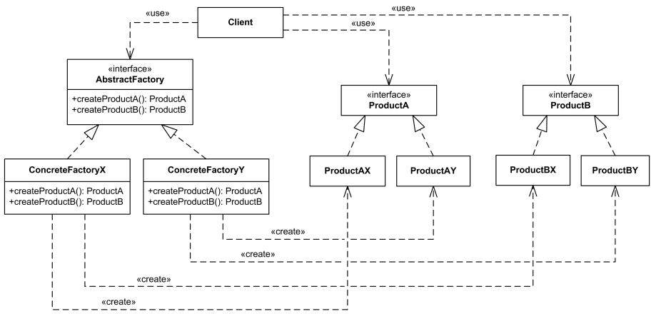

# Abstract Factory 디자인 패턴

# 01. 가장 실질적인 코드와 이를 활용하는 실제 사례

## 1. 구현 코드
[code](code)

## 2. 사용 사례
### 공통점 : 연관 객체'군' 필요 & 구체적 제품 몰라도 사용 가능해야 

- 운영 체제 테마 (OS Themes)
  - 운영 체제별 다른 테마(다크 모드, 라이트 모드) UI 컴포넌트를 생성
- 크로스 플랫폼 파일 시스템
  - 서로 다른 운영 체제의 파일 시스템(Windows, Linux, macOS)을 지원해야 할 때.

# 02.  패턴이 가지는 강점과 약점

## 1. 장단점
### 장점 3
#### 1. 관련 객체군의 일관된 생성 보장
    - 서로 관련된 객체를 일관성 있게 생성하므로, 생성된 객체들이 서로 잘 호환되도록 보장
#### 2. 결합도 감소
    - 클라이언트는 구체적인 클래스 대신 추상 인터페이스에 의존하므로, 객체 생성과 관련된 결합도가 낮아짐
#### 3. 확장성 향상
    - 새로운 제품군(객체군)을 추가할 때, 기존 코드에 영향을 주지 않고 새로운 Factory와 Product를 정의하면 됨 

### 단점 4
#### 1. 복잡성 증가
    - 객체 생성에 필요한 추가 인터페이스와 클래스가 증가하여 설계가 복잡해짐 
#### 2. 확장 시 클래스 폭발 가능성
    - 각 제품군(Product)의 변형마다 새로운 Factory와 Product 클래스를 추가해야 함 
#### 3. 추가 코드 작성 부담
    - 새로운 객체군을 추가할 때, Factory와 관련 Product들을 모두 정의해야 하므로 초기 개발 작업이 많아질 수 있음
#### 4. 유연성 제한
    - Factory가 객체군을 강하게 묶어서 관리하므로, 다른 객체군과 조합이 필요한 경우 유연성이 떨어질 수 있음 

# 03. 동작 방식 이해 후, 이를 뒷받침하는 구조와 정의

## 1. 동작 원리

## 2. 구조 - 4

 - 출처 : https://www.uml-diagrams.org/design-pattern-abstract-factory-uml-class-diagram-example.html : 

### 1) AbstractFactory (추상 팩토리)
- 관련 제품군을 생성하는 팩토리 메서드들을 정의

### 2) ConcreteFactory (구체 팩토리)
- AbstractFactory를 구현하여, 특정 제품군의 객체를 생성

### 3) AbstractProduct (추상 제품)
- 각 제품 유형의 공통 인터페이스를 정의

### 4) ConcreteProduct (구체 제품)
- AbstractProduct를 구현하며, 구체적인 제품을 정의

### cf) Client (사용자)
- AbstractFactory를 통해 객체를 생성, 구체적인 팩토리나 제품 클래스에 의존 안함

## 3. 정의
-  [관련된 객체군]을 생성하기 위한 [인터페이스를 제공]하는 디자인 패턴

## 4. 목적 3
### 1) 객체군 생성의 일관성 유지
### 2) 코드 확장성 증가
  - 새로운 제품군 추가 시, 기존 코드를 수정하지 않고 확장 가능
### 3) 구체적인 클래스 의존 제거
  - 클라이언트는 구체적인 제품 클래스나 생성 방식을 알 필요 없이 동작 가능 

# 04.  패턴이 적합한 상황과 선택의 이유를 다른 패턴과 비교하며 학습

## 1. 적용 조건
- 이 패턴이 적합한 상황은 언제인가요?
- 적용하기 위한 전제 조건이나 특정 문제 유형을 설명하세요.

## 2. 비교와 선택
- 이 패턴을 다른 유사한 패턴과 비교하세요.
  - 예: Factory Method와 Abstract Factory의 차이.
- 어떤 상황에서 이 패턴을 선택해야 하는지 설명하세요.

## 3. 관련된 패턴
- 이 패턴과 함께 자주 사용되는 패턴은 무엇인가요?
  - 예: Decorator 패턴은 Strategy 패턴과 함께 사용되기도 함.
- 다른 패턴과의 관계를 설명하세요.
  - 예: 이 패턴이 다른 패턴의 일부로 사용되거나, 서로 보완적 역할을 하는 경우.

# 04.  패턴을 실제로 사용할 때 발생할 수 있는 문제와 실전 사례

## 1. 오해와 주의점
- 이 패턴과 관련된 일반적인 오해는 무엇인가요?
  - 예: Singleton은 무조건 하나의 인스턴스만 생성된다는 오해.
- 패턴을 잘못 사용할 때 발생할 수 있는 문제를 설명하세요.
  - 예: 잘못된 Singleton 구현은 멀티스레드 환경에서 동기화 문제를 유발.

## 2. 프로젝트 경험
- 이 패턴을 실제 프로젝트에서 사용한 경험이 있나요?
- 사용했던 사례와 그 결과를 기록하세요.
  - 프로젝트 이름, 패턴 적용 이유, 결과 등.

## 3. 확장성
- 이 패턴을 확장하거나 변형하는 방법은 무엇인가요?
  - 예: Prototype 패턴에서 깊은 복사와 얕은 복사를 선택적으로 구현.
- 확장 가능한 구조로 설계하기 위한 팁이나 예시를 작성하세요.

## 4. 비용
- 이 패턴을 사용하는 데 드는 비용(성능, 코드 복잡도 등)을 분석하세요.
  - 예: Decorator는 클래스 수가 증가하여 코드가 복잡해질 수 있음.
- 효율적으로 사용할 수 있는 방법을 설명하세요.
  - 예: 필요 이상의 Decorator를 사용하지 않고 핵심 기능에만 적용.