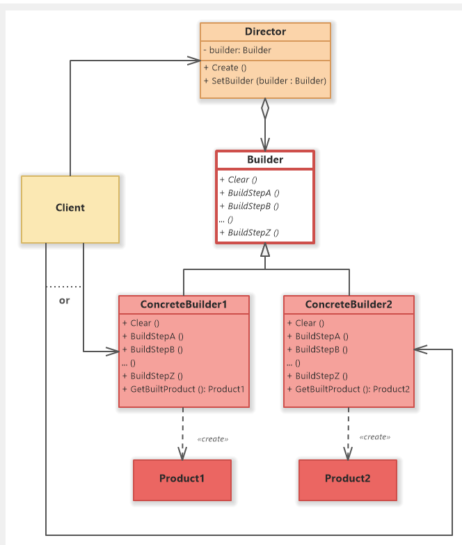

# Builder 디자인 패턴

# 01. 가장 실질적인 코드와 이를 활용하는 실제 사례

## 1. 구현 코드
[code](code)

## 2. 사용 사례
### 공통점 : 다양한 구성 가진 요소 생성. 필요 시 단계
- 복잡한 객체를 **단계적으로 생성**하며, 다양한 조합 가능.

- HTTP 요청 생성
  - HTTP 요청을 구성할 때 여러 요소를 조합
- SQL 쿼리 생성
  - 다양한 조건과 구문으로 쿼리를 조합해야

# 02.  패턴이 가지는 강점과 약점

## 1. 장단점
### 장점 4
#### 1. 복잡한 객체 생성 지원
    - 복잡한 객체를 단계적으로 생성하며, 객체 구성 요소의 생성과 조립을 분리
#### 2.코드 가독성 향상
    - 메서드 체이닝 방식을 사용하여 객체 생성 과정을 직관적으로 표현
#### 3. 객체 생성 로직 재사용
    - 동일한 Builder를 사용하여 다양한 설정으로 객체를 생성할
#### 4. 유연성
    - 필요한 구성 요소만 설정 가능하며, 불필요한 요소를 제외

### 단점 3
#### 1.복잡성 증가
    - 단순한 객체 생성에 사용하면, Builder 클래스와 메서드 체인으로 인해 설계가 복잡
#### 2. 객체 조립 과정의 명시적 설계 필요
    - 조립 과정과 순서를 명확히 정의해야 하며, 이를 잘못 설계하면 오히려 코드 유지보수가 어려워질 수 있음 
#### 3. 동일한 객체 생성 시 비효율성
    - 동일한 객체를 반복적으로 생성해야 할 경우, Prototype이나 Singleton과 결합이 필요

# 03. 동작 방식 이해 후, 이를 뒷받침하는 구조와 정의

## 1. 동작 원리
- 객체 생성 과정을 캡슐화 및 동일 생성 프로세스를 통해 다양한 객체를 생성

## 2. 구조

- 출처 : https://www.softwareideas.net/a/432/builder-design-pattern-uml-class-diagram-

### 1) Builder (추상 빌더)
- 복잡한 객체를 생성하는 단계별 인터페이스를 정의
예: setPartA(), setPartB().

### 2) ConcreteBuilder (구체 빌더)
- Builder를 구현하여 각 생성 단계에 대한 구체적인 로직을 제공
- getResult() 메서드를 통해 완성된 객체를 반환

### 3) Director (감독자) - 선택 
- Builder를 사용하여 객체 생성 과정을 순서대로 실행
- 객체 생성 순서를 클라이언트와 분리하여 객체 생성 과정을 캡슐화합니다.

### 4) Product (제품)
- 빌더를 통해 생성된 최종 객체
- 제품의 내부 구조가 클라이언트에게 숨겨져 있음

## 3. 정의
- 복잡한 객체 단계적 생성 및 객체 생성 과정 캡슐화하여
[클라이언트] 와 [객체 생성 로직] 간 의존성을 줄이는 디자인 패턴

## 4. 목적
### 1) 복잡한 객체 생성 단계 캡슐화
### 2) 유연성 및 재사용성 증가

# 04.  패턴이 적합한 상황과 선택의 이유를 다른 패턴과 비교하며 학습

## 1. 적용 조건
- 이 패턴이 적합한 상황은 언제인가요?
- 적용하기 위한 전제 조건이나 특정 문제 유형을 설명하세요.

## 2. 비교와 선택
- 이 패턴을 다른 유사한 패턴과 비교하세요.
  - 예: Factory Method와 Abstract Factory의 차이.
- 어떤 상황에서 이 패턴을 선택해야 하는지 설명하세요.

## 3. 관련된 패턴
- 이 패턴과 함께 자주 사용되는 패턴은 무엇인가요?
  - 예: Decorator 패턴은 Strategy 패턴과 함께 사용되기도 함.
- 다른 패턴과의 관계를 설명하세요.
  - 예: 이 패턴이 다른 패턴의 일부로 사용되거나, 서로 보완적 역할을 하는 경우.

# 04.  패턴을 실제로 사용할 때 발생할 수 있는 문제와 실전 사례

## 1. 오해와 주의점
- 이 패턴과 관련된 일반적인 오해는 무엇인가요?
  - 예: Singleton은 무조건 하나의 인스턴스만 생성된다는 오해.
- 패턴을 잘못 사용할 때 발생할 수 있는 문제를 설명하세요.
  - 예: 잘못된 Singleton 구현은 멀티스레드 환경에서 동기화 문제를 유발.

## 2. 프로젝트 경험
- 이 패턴을 실제 프로젝트에서 사용한 경험이 있나요?
- 사용했던 사례와 그 결과를 기록하세요.
  - 프로젝트 이름, 패턴 적용 이유, 결과 등.

## 3. 확장성
- 이 패턴을 확장하거나 변형하는 방법은 무엇인가요?
  - 예: Prototype 패턴에서 깊은 복사와 얕은 복사를 선택적으로 구현.
- 확장 가능한 구조로 설계하기 위한 팁이나 예시를 작성하세요.

## 4. 비용
- 이 패턴을 사용하는 데 드는 비용(성능, 코드 복잡도 등)을 분석하세요.
  - 예: Decorator는 클래스 수가 증가하여 코드가 복잡해질 수 있음.
- 효율적으로 사용할 수 있는 방법을 설명하세요.
  - 예: 필요 이상의 Decorator를 사용하지 않고 핵심 기능에만 적용.