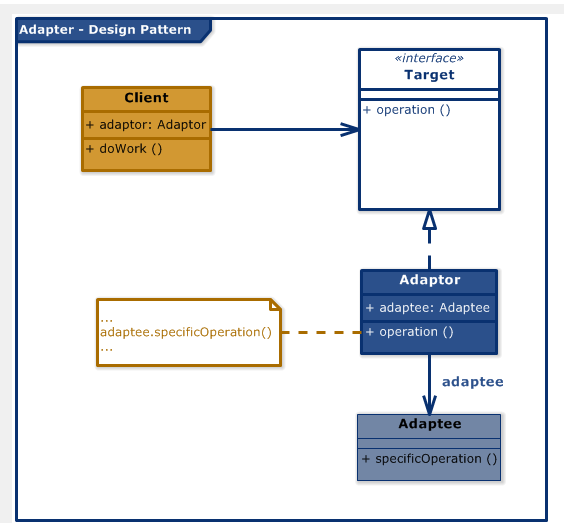

# Adapter 디자인 패턴

# 01. 가장 실질적인 코드와 이를 활용하는 실제 사례

## 1. 구현 코드
[code](code)

## 2. 사용 사례
### 공통점 : 외부 제공 != 내부 사용, 그러나 사용해야 

- 외부 라이브러리와 프로젝트의 통합
  - 라이브러리의 API가 프로젝트에서 사용하는 표준 인터페이스와 다를 때
-  소셜 미디어 API 통합
  - 서로 다른 소셜 미디어 플랫폼(Twitter, Facebook)의 API를 표준화.
    

# 02.  패턴이 가지는 강점과 약점

## 1. 장단점
### 장점 3 
#### 1. 호환성 향상
    - 서로 다른 인터페이스를 가진 클래스들이 함께 작동할 수 있도록 중재 역할을 수행
#### 2. 재사용성 증가
    - 기존 코드를 수정하지 않고도 새로운 환경에서 재사용
#### 3. 단일 책임 원칙 준수
    - Adapter는 변환 작업만 담당하며, 클라이언트와 기존 클래스의 책임을 분리

### 단점 3
#### 1. 복잡성 증가
    - 단순한 요구 사항에도 추가 클래스(Adapter)를 작성해야 하므로, 설계가 복잡해질 수 있음
#### 2. 과도한 사용 시 코드 가독성 저하
    - 여러 Adapter를 연결하거나 중첩해서 사용하면 코드 가독성이 떨어질 수 있음
#### 3. 기존 클래스에 대한 의존성 증가
    - Adapter는 기존 클래스의 메서드 호출에 의존하므로, 기존 클래스 변경 시 Adapter도 수정이 필요

# 03. 동작 방식 이해 후, 이를 뒷받침하는 구조와 정의

## 1. 동작 원리
- Target 인터페이스를 정의하고,
- Adapter가 이를 구현하여 기존 Adaptee를 클라이언트에 맞게 변환

## 2. 구조

- 출처 : https://www.softwareideas.net/a/383/adapter-design-pattern-uml-class-diagram-

### 1)Target (목표 인터페이스)
- 클라이언트가 기대하는 인터페이스
- Adapter는 이 인터페이스를 구현하여 클라이언트에 제공됨

### 2) Adaptee (적응 대상)
- 기존에 이미 존재하는 클래스
- Target 인터페이스와 호환되지 않으므로 직접 사용이 불가능

### 3) Adapter (적응자)
- Adaptee와 Target 사이의 중재자 역할을 수행
- Target 인터페이스를 구현하고, Adaptee의 기능을 변환하여 제공

### cf) Client (사용자)
- Target 인터페이스를 통해 Adapter를 사용
  - Adaptee의 존재를 알 필요 없음

## 3. 정의
- [기존 클래스의 인터페이스]를 [클라이언트에서 기대하는 인터페이스]로 변환하여,
- 호환되지 않는 클래스 간에 협력이 가능하도록 만드는 디자인 패턴

## 4. 목적
- 호환성 제공

# 04.  패턴이 적합한 상황과 선택의 이유를 다른 패턴과 비교하며 학습

## 1. 적용 조건
- 이 패턴이 적합한 상황은 언제인가요?
- 적용하기 위한 전제 조건이나 특정 문제 유형을 설명하세요.

## 2. 비교와 선택
- 이 패턴을 다른 유사한 패턴과 비교하세요.
  - 예: Factory Method와 Abstract Factory의 차이.
- 어떤 상황에서 이 패턴을 선택해야 하는지 설명하세요.

## 3. 관련된 패턴
- 이 패턴과 함께 자주 사용되는 패턴은 무엇인가요?
  - 예: Decorator 패턴은 Strategy 패턴과 함께 사용되기도 함.
- 다른 패턴과의 관계를 설명하세요.
  - 예: 이 패턴이 다른 패턴의 일부로 사용되거나, 서로 보완적 역할을 하는 경우.

# 04.  패턴을 실제로 사용할 때 발생할 수 있는 문제와 실전 사례

## 1. 오해와 주의점
- 이 패턴과 관련된 일반적인 오해는 무엇인가요?
  - 예: Singleton은 무조건 하나의 인스턴스만 생성된다는 오해.
- 패턴을 잘못 사용할 때 발생할 수 있는 문제를 설명하세요.
  - 예: 잘못된 Singleton 구현은 멀티스레드 환경에서 동기화 문제를 유발.

## 2. 프로젝트 경험
- 이 패턴을 실제 프로젝트에서 사용한 경험이 있나요?
- 사용했던 사례와 그 결과를 기록하세요.
  - 프로젝트 이름, 패턴 적용 이유, 결과 등.

## 3. 확장성
- 이 패턴을 확장하거나 변형하는 방법은 무엇인가요?
  - 예: Prototype 패턴에서 깊은 복사와 얕은 복사를 선택적으로 구현.
- 확장 가능한 구조로 설계하기 위한 팁이나 예시를 작성하세요.

## 4. 비용
- 이 패턴을 사용하는 데 드는 비용(성능, 코드 복잡도 등)을 분석하세요.
  - 예: Decorator는 클래스 수가 증가하여 코드가 복잡해질 수 있음.
- 효율적으로 사용할 수 있는 방법을 설명하세요.
  - 예: 필요 이상의 Decorator를 사용하지 않고 핵심 기능에만 적용.