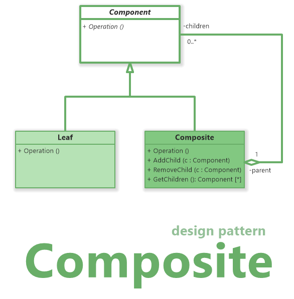

# Composite 디자인 패턴

# 01. 가장 실질적인 코드와 이를 활용하는 실제 사례

## 1. 구현 코드
[code](code)

## 2. 사용 사례
### 공통점 : 그룹과 개별 동일 처리

- 파일 시스템
  - Folder 객체가 파일(File) 및 다른 폴더를 포함할 수 있는 구조
- 회사 조직도
  - 직원과 부서가 계층적으로 구성
  - CEO → 부서 → 팀 → 팀원.

# 02.  패턴이 가지는 강점과 약점

## 1. 장단점
### 장점
#### 1. 계층적 구조 표현
    - 트리 구조와 같은 계층적 관계를 명확히 표현
#### 2. 개별 객체와 그룹 객체의 일관된 처리
    - 개별 객체(Leaf)와 그룹 객체(Composite)를 동일하게 처리 가능 
#### 3. 확장성 향상
    - 새로운 요소(Leaf나 Composite)를 추가하더라도 기존 코드를 수정하지 않고 확장 가능
      - 새로운 UI 컴포넌트를 추가할 때 기존 코드를 수정하지 않고 계층 구조에 포함 

### 단점
#### 1. 설계의 복잡성 증가
    - 추가적인 클래스와 인터페이스를 작성해야 하므로 설계가 복잡
    - 간단한 계층 구조에 적용하면 오히려 과잉 설계
#### 2. 객체 관계 추적 어려움
    - 계층 구조가 깊어질수록 객체 간 관계를 추적하는 것이 어려워질 수 있음 
#### 3.공통 메서드의 비효율성
    - 모든 요소(Leaf와 Composite)가 공통 메서드를 구현해야 하므로, 일부 요소에서는 불필요한 메서드가 포함될 수 있음 

# 03. 동작 방식 이해 후, 이를 뒷받침하는 구조와 정의

## 1. 동작 원리
- 단일 객체(Leaf)와 그룹 객체(Composite)를 동일한 인터페이스로 사용
- 재귀적으로 객체를 구성하여, 계층 구조를 처리

## 2. 구조

- 출처 : https://www.softwareideas.net/a/445/composite-design-pattern-uml-class-diagram-

### 1) Component (추상 컴포넌트)
- Leaf와 Composite에 공통된 인터페이스를 정의
  - 예: operation(), add(), remove().

### 2) Leaf (단일 객체)
- 트리의 최종 단위 요소, 자식 객체를 가질 수 없음
  - add(), remove() 메서드는 구현하지 않거나 예외를 던지게 함

### 3)Composite (복합 객체)
- 자식 객체(Leaf나 다른 Composite)를 포함하는 컨테이너 역할을 함
  - add()와 remove() 메서드를 사용하여 자식 객체를 관리

### cf) Client (사용자)
- Component 인터페이스를 통해 단일 객체(Leaf)와 그룹 객체(Composite)를 동일하게 처리

## 3. 정의
-  객체를 트리 구조로 구성하여 단일 객체와 그룹 객체를 동일하게 처리할 수 있도록 하는 디자인 패턴

## 4. 목적
### 1) 객체를 계층적으로 구성하여, 그룹과 개별 객체를 동일하게 처리.
### 2) 트리 구조를 쉽게 탐색하고, 동일한 연산을 적용할 수 있도록 설계
### 3) 새로운 Leaf나 Composite 객체를 추가하더라도 기존 코드를 수정하지 않게 함 

# 04.  패턴이 적합한 상황과 선택의 이유를 다른 패턴과 비교하며 학습

## 1. 적용 조건
- 이 패턴이 적합한 상황은 언제인가요?
- 적용하기 위한 전제 조건이나 특정 문제 유형을 설명하세요.

## 2. 비교와 선택
- 이 패턴을 다른 유사한 패턴과 비교하세요.
  - 예: Factory Method와 Abstract Factory의 차이.
- 어떤 상황에서 이 패턴을 선택해야 하는지 설명하세요.

## 3. 관련된 패턴
- 이 패턴과 함께 자주 사용되는 패턴은 무엇인가요?
  - 예: Decorator 패턴은 Strategy 패턴과 함께 사용되기도 함.
- 다른 패턴과의 관계를 설명하세요.
  - 예: 이 패턴이 다른 패턴의 일부로 사용되거나, 서로 보완적 역할을 하는 경우.

# 04.  패턴을 실제로 사용할 때 발생할 수 있는 문제와 실전 사례

## 1. 오해와 주의점
- 이 패턴과 관련된 일반적인 오해는 무엇인가요?
  - 예: Singleton은 무조건 하나의 인스턴스만 생성된다는 오해.
- 패턴을 잘못 사용할 때 발생할 수 있는 문제를 설명하세요.
  - 예: 잘못된 Singleton 구현은 멀티스레드 환경에서 동기화 문제를 유발.

## 2. 프로젝트 경험
- 이 패턴을 실제 프로젝트에서 사용한 경험이 있나요?
- 사용했던 사례와 그 결과를 기록하세요.
  - 프로젝트 이름, 패턴 적용 이유, 결과 등.

## 3. 확장성
- 이 패턴을 확장하거나 변형하는 방법은 무엇인가요?
  - 예: Prototype 패턴에서 깊은 복사와 얕은 복사를 선택적으로 구현.
- 확장 가능한 구조로 설계하기 위한 팁이나 예시를 작성하세요.

## 4. 비용
- 이 패턴을 사용하는 데 드는 비용(성능, 코드 복잡도 등)을 분석하세요.
  - 예: Decorator는 클래스 수가 증가하여 코드가 복잡해질 수 있음.
- 효율적으로 사용할 수 있는 방법을 설명하세요.
  - 예: 필요 이상의 Decorator를 사용하지 않고 핵심 기능에만 적용.