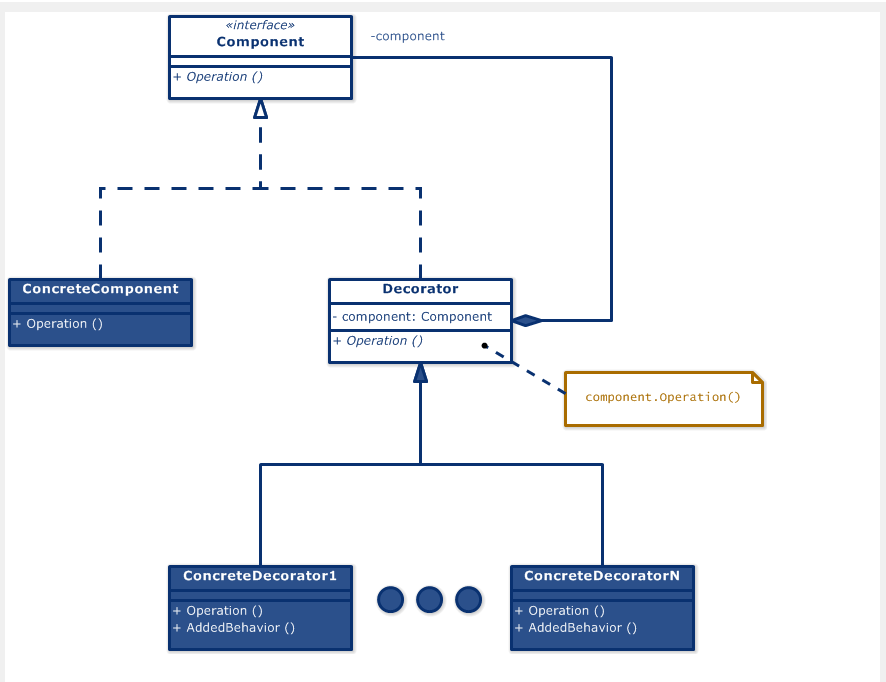

# Decorator 디자인 패턴

# 01. 가장 실질적인 코드와 이를 활용하는 실제 사례

## 1. 구현 코드
[code](code)

## 2. 사용 사례
### 공통점 : 기능 동적 확장 및 기능 확장들의 조합 

- 커피 주문 시스템 
  - 다양한 추가 옵션(우유, 설탕, 시럽)을 동적으로 추가
- 데이터 검증
  - 데이터 입력 검증(필수 필드 체크, 이메일 형식 확인)을 단계적으로 추가
  - Component: Validator 인터페이스.
  - ConcreteComponent: 기본 검증(BaseValidator).
  - ConcreteDecorator
    - 이메일 검증(EmailValidator)
    - 숫자 범위 검증(RangeValidator).

# 02.  패턴이 가지는 강점과 약점

## 1. 장단점
### 장점 2
#### 1. 개방-폐쇄 원칙(OCP) 준수
    - 기존 객체를 수정하지 않고 동적으로 기능을 추가할 수 있음 
#### 2. 동적 기능 추가 가능
    - 실행 중에 객체의 기능을 동적으로 추가하거나 제거할 수 있음

### 단점 4
#### 1. 설계 및 구현 복잡성 증가
    - 계층적으로 설계하면 구조가 복잡해지고 디버깅이 어려워질 수 있음.
#### 2. 객체 식별 어려움 
    - Decorator로 감싸진 객체는 원래 객체와 구분하기 어려우며, 타입 확인이 복잡해질 수 있음
#### 3. 객체 생성 복잡성 증가
    - 여러 Decorator를 적용할 때 생성 순서를 명시적으로 관리해야 함
#### 4. 과도한 Decorator 사용의 성능 문제
    - 매번 새로운 Decorator 객체를 생성하고 호출해야 하므로 실행 시간이 늘어날 수 있음

# 03. 동작 방식 이해 후, 이를 뒷받침하는 구조와 정의

## 1. 동작 원리
- 컴포지션(위임)을 활용하여 객체를 감싸고, 동적으로 기능을 추가.
- 기능 확장이 필요한 경우 상속 대신 데코레이터로 기능을 조합

## 2. 구조

#### 1) Component (컴포넌트)
- 기본 인터페이스로, [기본 객체]와 [데코레이터]가 공통적으로 구현해야 할 메서드를 정의

#### 2) ConcreteComponent (구체 컴포넌트)
- 기본 동작을 제공하는 객체
- Decorator가 감싸서 동작을 확장

##### 3) Decorator (추상 데코레이터)
- Component를 구현하며, 기존 Component 객체를 참조
- 기본 동작을 위임하고, 추가 동작을 정의할 수 있음 

#### 4) ConcreteDecorator (구체 데코레이터)
- Decorator를 확장하여, 추가 동작(behavior)을 정의
- 기존 Component 객체에 동적으로 새로운 기능을 추가

#### cf) Client (사용자)
- Component 인터페이스를 사용
- - ConcreteComponent와 Decorator를 동일하게 처리

## 3. 정의
-  기존 객체를 수정하지 않고, 동적으로 행동(기능)을 추가할 수 있도록 설계된 패턴
- 위임을 통해 기능을 확장하여, 상속의 한계를 극복
  - 위임 : 클래스 내부에서 다른 객체를 속성으로 포함하고, 해당 객체의 메서드를 호출(위임)

## 4. 목적
### 1) 동적 기능 확장
### 2) 기능 조합
### 3) 클래스 폭발 방지

# 04.  패턴이 적합한 상황과 선택의 이유를 다른 패턴과 비교하며 학습

## 1. 적용 조건
- 이 패턴이 적합한 상황은 언제인가요?
- 적용하기 위한 전제 조건이나 특정 문제 유형을 설명하세요.

## 2. 비교와 선택
- 이 패턴을 다른 유사한 패턴과 비교하세요.
  - 예: Factory Method와 Abstract Factory의 차이.
- 어떤 상황에서 이 패턴을 선택해야 하는지 설명하세요.

## 3. 관련된 패턴
- 이 패턴과 함께 자주 사용되는 패턴은 무엇인가요?
  - 예: Decorator 패턴은 Strategy 패턴과 함께 사용되기도 함.
- 다른 패턴과의 관계를 설명하세요.
  - 예: 이 패턴이 다른 패턴의 일부로 사용되거나, 서로 보완적 역할을 하는 경우.

# 04.  패턴을 실제로 사용할 때 발생할 수 있는 문제와 실전 사례

## 1. 오해와 주의점
- 이 패턴과 관련된 일반적인 오해는 무엇인가요?
  - 예: Singleton은 무조건 하나의 인스턴스만 생성된다는 오해.
- 패턴을 잘못 사용할 때 발생할 수 있는 문제를 설명하세요.
  - 예: 잘못된 Singleton 구현은 멀티스레드 환경에서 동기화 문제를 유발.

## 2. 프로젝트 경험
- 이 패턴을 실제 프로젝트에서 사용한 경험이 있나요?
- 사용했던 사례와 그 결과를 기록하세요.
  - 프로젝트 이름, 패턴 적용 이유, 결과 등.

## 3. 확장성
- 이 패턴을 확장하거나 변형하는 방법은 무엇인가요?
  - 예: Prototype 패턴에서 깊은 복사와 얕은 복사를 선택적으로 구현.
- 확장 가능한 구조로 설계하기 위한 팁이나 예시를 작성하세요.

## 4. 비용
- 이 패턴을 사용하는 데 드는 비용(성능, 코드 복잡도 등)을 분석하세요.
  - 예: Decorator는 클래스 수가 증가하여 코드가 복잡해질 수 있음.
- 효율적으로 사용할 수 있는 방법을 설명하세요.
  - 예: 필요 이상의 Decorator를 사용하지 않고 핵심 기능에만 적용.