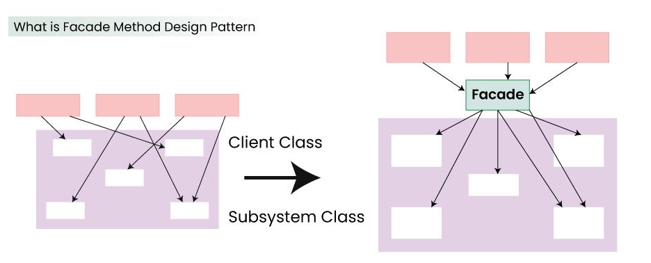

# Facade 디자인 패턴

# 01. 가장 실질적인 코드와 이를 활용하는 실제 사례

## 1. 구현 코드
[code](code)

## 2. 사용 사례
### 공통점 : 서브시스템 단순화 

- 웹 애플리케이션 요청 처리
  - Service 가 Facade 역할

# 02.  패턴이 가지는 강점과 약점

## 1. 장단점
### 장점 3
#### 1. 복잡성 감소
    - 서브시스템의 복잡한 로직을 캡슐화하고, 단순한 인터페이스를 제공
#### 2. 서브시스템 변경의 영향 감소
    - 서브시스템이 변경되더라도, [Facade를 통해 접근하는 클라이언트] 는 변경의 영향을 받지 않음 
#### 3. 단일 진입점 제공
    - 여러 서브시스템에 대한 단일 진입점을 제공하여, 서브시스템의 관리와 제어가 용이

### 단점 4
#### 1. 기능 제한
    - 클라이언트가 서브시스템의 세부 동작에 직접 접근해야 하는 경우, Facade가 부족한 역할을 할 수 있음
#### 2. 단일 진입점 의존성
    - Facade가 실패하면 모든 클라이언트가 영향을 받을 수 있음
#### 3. 서브시스템과의 결합
    -  서브시스템의 구조가 변경되면 Facade 역시 수정이 필요
#### 4. 확장성 제한
    - 새로운 기능 추가로 Facade가 점점 복잡해질 가능성

# 03. 동작 방식 이해 후, 이를 뒷받침하는 구조와 정의

## 1. 동작 원리
- 여러 개의 서브시스템을 하나의 Facade 객체로 묶어서 단순한 인터페이스를 제공

## 2. 구조

- 출처 : https://www.geeksforgeeks.org/facade-design-pattern-introduction/

### 1) Facade (퍼사드)
- 복잡한 서브시스템을 캡슐화하고, 단순화된 인터페이스를 제공
- 클라이언트는 Facade를 통해 서브시스템에 접근하며, 내부 서브시스템에 직접 접근하지 않음

### 2) Subsystem (서브시스템)
- 서브시스템의 복잡한 논리를 포함하며, 직접 호출이 가능
- Facade는 이 서브시스템의 동작을 호출하여 클라이언트에 결과를 제공

### 3) Client (사용자)
- Facade를 통해 서브시스템과 상호작용하며, 서브시스템의 세부 구현을 알 필요가 없음

## 3. 정의
- 복잡한 서브시스템의 인터페이스를 단순화하여, 클라이언트가 간단하게 사용할 수 있는 고수준의 인터페이스를 제공하는 패턴

## 4. 목적 
### 1) 복잡성 감소
### 2) 서브시스템 캡슐화

# 04.  패턴이 적합한 상황과 선택의 이유를 다른 패턴과 비교하며 학습

## 1. 적용 조건
- 이 패턴이 적합한 상황은 언제인가요?
- 적용하기 위한 전제 조건이나 특정 문제 유형을 설명하세요.

## 2. 비교와 선택
- 이 패턴을 다른 유사한 패턴과 비교하세요.
  - 예: Factory Method와 Abstract Factory의 차이.
- 어떤 상황에서 이 패턴을 선택해야 하는지 설명하세요.

## 3. 관련된 패턴
- 이 패턴과 함께 자주 사용되는 패턴은 무엇인가요?
  - 예: Decorator 패턴은 Strategy 패턴과 함께 사용되기도 함.
- 다른 패턴과의 관계를 설명하세요.
  - 예: 이 패턴이 다른 패턴의 일부로 사용되거나, 서로 보완적 역할을 하는 경우.

# 04.  패턴을 실제로 사용할 때 발생할 수 있는 문제와 실전 사례

## 1. 오해와 주의점
- 이 패턴과 관련된 일반적인 오해는 무엇인가요?
  - 예: Singleton은 무조건 하나의 인스턴스만 생성된다는 오해.
- 패턴을 잘못 사용할 때 발생할 수 있는 문제를 설명하세요.
  - 예: 잘못된 Singleton 구현은 멀티스레드 환경에서 동기화 문제를 유발.

## 2. 프로젝트 경험
- 이 패턴을 실제 프로젝트에서 사용한 경험이 있나요?
- 사용했던 사례와 그 결과를 기록하세요.
  - 프로젝트 이름, 패턴 적용 이유, 결과 등.

## 3. 확장성
- 이 패턴을 확장하거나 변형하는 방법은 무엇인가요?
  - 예: Prototype 패턴에서 깊은 복사와 얕은 복사를 선택적으로 구현.
- 확장 가능한 구조로 설계하기 위한 팁이나 예시를 작성하세요.

## 4. 비용
- 이 패턴을 사용하는 데 드는 비용(성능, 코드 복잡도 등)을 분석하세요.
  - 예: Decorator는 클래스 수가 증가하여 코드가 복잡해질 수 있음.
- 효율적으로 사용할 수 있는 방법을 설명하세요.
  - 예: 필요 이상의 Decorator를 사용하지 않고 핵심 기능에만 적용.