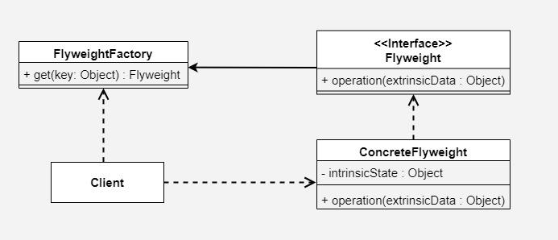

# Flyweight 디자인 패턴

# 01. 가장 실질적인 코드와 이를 활용하는 실제 사례

## 1. 구현 코드
[code](code)

## 2. 사용 사례
### 공통점 : 동일 요소 생성 대신 재사용 시  - 메모리 절약, 반복 작업 제거

- 텍스트 렌더링 시스템
  -  동일한 문자 객체를 공유하여 메모리를 절약.
-  이미지 객체 캐싱
  -  동일한 이미지 파일 객체를 캐시에 저장하고 재사용.

# 02.  패턴이 가지는 강점과 약점

## 1. 장단점
### 장점 3
#### 1. 객체 생성 비용 감소
    - 동일한 객체를 재사용하기 때문에, 객체를 생성하고 소멸시키는 데 드는 비용이 줄어듬 
#### 2. 성능 향상
    - 동일한 이미지 데이터를 메모리에 한 번만 로드 및 관리하여, 불필요한 생성과 소멸로 인한 GC 부담이 줄어듬 
#### 3. 데이터의 일관성 유지
    - 공통 객체를 재사용하므로, 중복 데이터가 일관되게 관리

### 단점 3 
#### 1. 코드 복잡성 증가
    - 객체의 공유 상태와 개별 상태를 분리해야 하므로, 설계와 구현이 복잡해질 수 있음
#### 2. 공유 객체의 식별 어려움
    - 동일한 인스턴스를 재사용하므로, 특정 객체를 식별하거나 추적하기 어려움 
#### 3. 추가적인 관리 필요
    - 공유 객체를 효율적으로 관리하기 위해 객체 풀이나 캐싱 전략을 별도로 설계해야 함 

# 03. 동작 방식 이해 후, 이를 뒷받침하는 구조와 정의

## 1. 동작 원리
- 상태를 공유 가능한 "내부 상태"와 공유되지 않는 "외부 상태"로 구분

## 2. 구조

- 출처 : https://www.geeksforgeeks.org/flyweight-design-pattern/?ref=lbp

### 1)Flyweight (추상 플라이웨이트)
- 공통된 인터페이스로, operation(extrinsicState) 메서드를 정의
- 내부 상태는 Flyweight 객체 내부에 저장되며, 외부 상태는 클라이언트에 의해 전달
### 2) ConcreteFlyweight (구체 플라이웨이트)
- Flyweight 인터페이스를 구현하며, 내부 상태를 저장 및 관리
- 외부 상태는 메서드 호출 시 클라이언트가 제공합니다.
### 3) FlyweightFactory (플라이웨이트 팩토리)
- Flyweight 객체를 생성 및 관리하며, 기존 객체를 재사용
- 요청 시, 내부 상태에 따라 이미 생성된 Flyweight 객체를 반환하거나 새로 생성

### cf) Client (클라이언트)
- FlyweightFactory를 통해 Flyweight 객체를 요청하며, 외부 상태를 제공

## 3. 정의
- 공유를 통해 객체의 메모리 사용을 최소화하는 디자인 패턴
- 객체의 상태를 공유 가능한 내부 상태와 공유되지 않는 외부 상태로 구분하여 설계

## 4. 목적
### 1) 메모리 절약
### 2) 확장성 증가
  - 새로운 Flyweight 객체가 필요해도, 기존 Factory를 통해 관리 가능

# 04.  패턴이 적합한 상황과 선택의 이유를 다른 패턴과 비교하며 학습

## 1. 적용 조건
- 이 패턴이 적합한 상황은 언제인가요?
- 적용하기 위한 전제 조건이나 특정 문제 유형을 설명하세요.

## 2. 비교와 선택
- 이 패턴을 다른 유사한 패턴과 비교하세요.
  - 예: Factory Method와 Abstract Factory의 차이.
- 어떤 상황에서 이 패턴을 선택해야 하는지 설명하세요.

## 3. 관련된 패턴
- 이 패턴과 함께 자주 사용되는 패턴은 무엇인가요?
  - 예: Decorator 패턴은 Strategy 패턴과 함께 사용되기도 함.
- 다른 패턴과의 관계를 설명하세요.
  - 예: 이 패턴이 다른 패턴의 일부로 사용되거나, 서로 보완적 역할을 하는 경우.

# 04.  패턴을 실제로 사용할 때 발생할 수 있는 문제와 실전 사례

## 1. 오해와 주의점
- 이 패턴과 관련된 일반적인 오해는 무엇인가요?
  - 예: Singleton은 무조건 하나의 인스턴스만 생성된다는 오해.
- 패턴을 잘못 사용할 때 발생할 수 있는 문제를 설명하세요.
  - 예: 잘못된 Singleton 구현은 멀티스레드 환경에서 동기화 문제를 유발.

## 2. 프로젝트 경험
- 이 패턴을 실제 프로젝트에서 사용한 경험이 있나요?
- 사용했던 사례와 그 결과를 기록하세요.
  - 프로젝트 이름, 패턴 적용 이유, 결과 등.

## 3. 확장성
- 이 패턴을 확장하거나 변형하는 방법은 무엇인가요?
  - 예: Prototype 패턴에서 깊은 복사와 얕은 복사를 선택적으로 구현.
- 확장 가능한 구조로 설계하기 위한 팁이나 예시를 작성하세요.

## 4. 비용
- 이 패턴을 사용하는 데 드는 비용(성능, 코드 복잡도 등)을 분석하세요.
  - 예: Decorator는 클래스 수가 증가하여 코드가 복잡해질 수 있음.
- 효율적으로 사용할 수 있는 방법을 설명하세요.
  - 예: 필요 이상의 Decorator를 사용하지 않고 핵심 기능에만 적용.