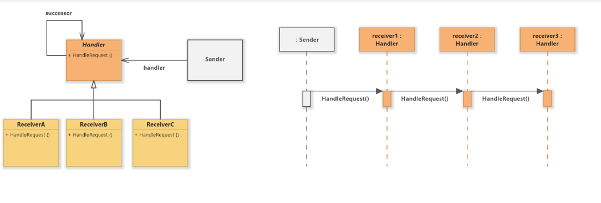

# chain of responsibility 디자인 패턴

# 01. 가장 실질적인 코드와 이를 활용하는 실제 사례

## 1. 구현 코드
[code](code)

## 2. 사용 사례
### 공통점 : 단계별/수준별 처리 필요 시 

- 권한 별 처리 시스템
  - 적절한 권한 레벨에 따라 요청을 처리.
- 데이터 검증 시스템
  - 단계별 적절한 검증 

# 02.  패턴이 가지는 강점과 약점

## 1. 장단점
### 장점 3
#### 1. 요청 처리의 유연성
    - 각 요청을 여러 처리기(Handler)가 처리할 수 있도록 체인을 구성하여, 요청 처리의 유연성을 높임.
      - 각 이벤트를 적절한 핸들러로 전달
#### 2. 결합도 감소
    - 요청 발신자와 처리자 간의 직접적인 결합을 제거하여, 발신자와 처리자를 독립적으로 관리
#### 3. 책임 분리
    - 각 처리기는 자신의 책임에만 집중할 수 있으므로, 단일 책임 원칙(SRP)을 준수

### 단점 3
#### 1. 요청 흐름 추적 어려움
    - 요청이 체인을 따라 이동하기 때문에, 디버깅 및 요청 흐름 추적이 어려울 수 있음
#### 2. 체인 설정 복잡성
    - 체인을 구성하고 관리하는 과정에서, 핸들러 순서나 연결 구조를 잘못 설계하면 문제가 발생할 수 있음
      - 핸들러 간의 의존성이 있을 경우, 체인 순서를 잘못 설정하면 요청 처리 실패
#### 3. 처리 실패 시 대안 없음
    - 체인의 끝까지 전달된 후에도 처리되지 않으면, 요청 처리가 실패한 상태로 남을 수 있음

# 03. 동작 방식 이해 후, 이를 뒷받침하는 구조와 정의

## 1. 동작 원리
요청을 처리하는 객체들을 체인 형태로 연결하여,
- 요청을 처리할 수 있는 객체가 등장할 때까지 순차적으로 요청을 전달하는 구조

## 2. 구조

- 출처 : https://www.softwareideas.net/a/452/chain-of-responsibility-design-pattern-uml-diagrams-

### 1) Handler (추상 핸들러)
- 요청 처리의 인터페이스를 정의하며, 다음 처리자를 설정하는 메서드(setNextHandler)를 포함
- 요청을 처리하거나, 다음 처리자에게 요청을 전달하는 handleRequest 메서드를 선언
### 2) ConcreteHandler (구체 핸들러)
- Handler를 구현하며, 요청을 처리하거나 다음 핸들러로 전달
- 각 ConcreteHandler는 특정 조건에 따라 요청을 처리하거나 넘김
### 3) Client (클라이언트)
- 요청을 초기 핸들러에게 전달하며, 처리 과정을 관리하지 않음

## 3. 정의
-  요청을 처리하는 여러 객체가 체인 형태로 연결되어, 각 객체가 요청을 처리하거나 다음 객체로 요청을 전달하는 패턴

## 4. 목적 3
### 1) 책임 분리
- 각 객체는 특정 요청에 대해서만 책임을 가지며, 나머지 요청은 다음 객체로 전달
### 2) 결합도 감소
- 클라이언트와 요청 처리 객체 간의 결합도를 줄여 유연성을 높임

### 3) 유연한 요청 처리
- 새로운 처리 객체를 추가하거나 기존 객체를 제거해도 클라이언트 코드에 영향을 주지 않음

# 04.  패턴이 적합한 상황과 선택의 이유를 다른 패턴과 비교하며 학습

## 1. 적용 조건
- 이 패턴이 적합한 상황은 언제인가요?
- 적용하기 위한 전제 조건이나 특정 문제 유형을 설명하세요.

## 2. 비교와 선택
- 이 패턴을 다른 유사한 패턴과 비교하세요.
  - 예: Factory Method와 Abstract Factory의 차이.
- 어떤 상황에서 이 패턴을 선택해야 하는지 설명하세요.

## 3. 관련된 패턴
- 이 패턴과 함께 자주 사용되는 패턴은 무엇인가요?
  - 예: Decorator 패턴은 Strategy 패턴과 함께 사용되기도 함.
- 다른 패턴과의 관계를 설명하세요.
  - 예: 이 패턴이 다른 패턴의 일부로 사용되거나, 서로 보완적 역할을 하는 경우.

# 04.  패턴을 실제로 사용할 때 발생할 수 있는 문제와 실전 사례

## 1. 오해와 주의점
- 이 패턴과 관련된 일반적인 오해는 무엇인가요?
  - 예: Singleton은 무조건 하나의 인스턴스만 생성된다는 오해.
- 패턴을 잘못 사용할 때 발생할 수 있는 문제를 설명하세요.
  - 예: 잘못된 Singleton 구현은 멀티스레드 환경에서 동기화 문제를 유발.

## 2. 프로젝트 경험
- 이 패턴을 실제 프로젝트에서 사용한 경험이 있나요?
- 사용했던 사례와 그 결과를 기록하세요.
  - 프로젝트 이름, 패턴 적용 이유, 결과 등.

## 3. 확장성
- 이 패턴을 확장하거나 변형하는 방법은 무엇인가요?
  - 예: Prototype 패턴에서 깊은 복사와 얕은 복사를 선택적으로 구현.
- 확장 가능한 구조로 설계하기 위한 팁이나 예시를 작성하세요.

## 4. 비용
- 이 패턴을 사용하는 데 드는 비용(성능, 코드 복잡도 등)을 분석하세요.
  - 예: Decorator는 클래스 수가 증가하여 코드가 복잡해질 수 있음.
- 효율적으로 사용할 수 있는 방법을 설명하세요.
  - 예: 필요 이상의 Decorator를 사용하지 않고 핵심 기능에만 적용.