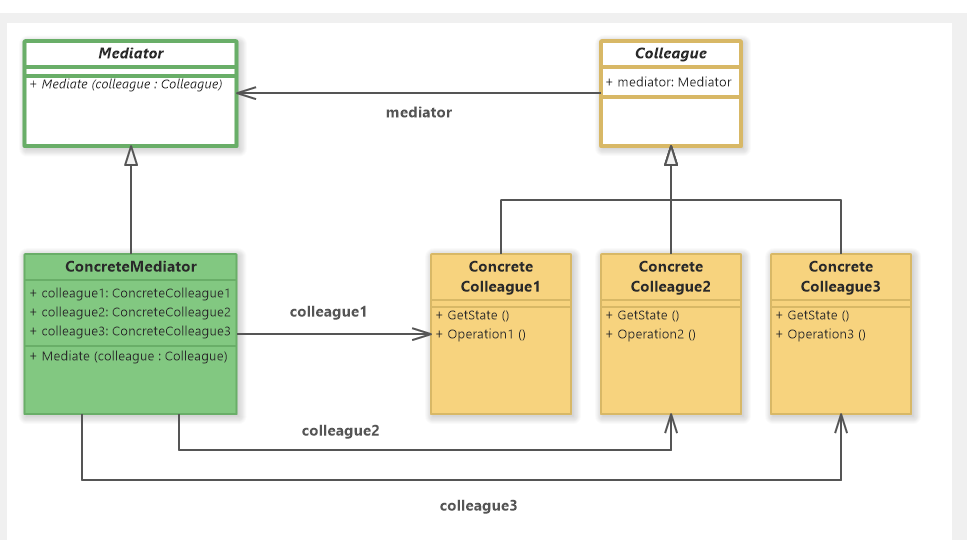

# Mediator 디자인 패턴

# 01. 가장 실질적인 코드와 이를 활용하는 실제 사례

## 1. 구현 코드
[code](code)

## 2. 사용 사례
### 공통점 : 객체간 연결 없이, 중앙 관리 

- 채팅 시스템
  - 사용자 간 직접 통신이 아닌 서버를 통해 메시지를 주고받음
- 항공 교통 관리 시스템
  - 항공기 간 직접 통신 없이, 관제탑(Mediator)을 통해 모든 조정이 이루어짐.

# 02.  패턴이 가지는 강점과 약점

## 1. 장단점
### 장점 3
#### 1. 객체 간 결합도 감소
    - Mediator를 통해 객체 간 직접적인 의존성을 제거하여, 객체들 간의 결합도를 낮춤
#### 2. 객체 간 통신 로직 캡슐화
    - Mediator는 객체 간 통신 로직을 캡슐화하여, 클라이언트 객체가 통신 방식을 몰라도 동작할 수 있음
#### 3. 확장성 향상
    - 새로운 객체를 추가해도 Mediator와의 통신 방식만 구현하면 되므로, 전체 시스템에 영향을 주지 않음

### 단점 3
#### 1. Mediator의 복잡성 증가
    - Mediator에 너무 많은 로직이 집중되면, Mediator 자체가 복잡해지고, 유지보수가 어려워질 수 있음
#### 2. 단일 실패 지점
    - Mediator에 문제가 발생하면, 이를 의존하는 모든 객체가 영향을 받으므로 단일 실패 지점이 될 수 있음
#### 3. 의존성 이동
    - 객체 간 결합도를 줄이는 대신, Mediator와의 결합도가 증가하여, Mediator에 대한 의존성이 높아질 수 있음

# 03. 동작 방식 이해 후, 이를 뒷받침하는 구조와 정의

## 1. 동작 원리
-  중재자가 객체 간의 소통을 조정하며, 객체 간의 직접적인 연결을 없앰 

## 2. 구조

- 출처 : https://www.softwareideas.net/a/1475/mediator-design-pattern-uml-diagrams-

### 1) Mediator (중재자 인터페이스)
- Colleague 객체 간의 상호작용을 정의
- 객체 간 통신 로직을 캡슐화하여, 모든 요청을 Mediator로 전달
### 2) ConcreteMediator (구체 중재자)
- Mediator 인터페이스를 구현하며, Colleague 객체 간의 구체적인 상호작용을 조정
- 모든 Colleague 객체를 참조하고, 통신 로직을 처리

### 3) Colleague (동료 객체)
- Mediator를 통해 다른 Colleague 객체와 상호작용
- 직접적으로 다른 객체와 소통하지 않고, Mediator를 사용하여 작업을 수행

### 4) ConcreteColleague (구체 동료 객체)
- Colleague를 구현하며, Mediator와 통신을 통해 작업을 수행

## 3. 정의
- 객체 간의 복잡한 상호작용을 한 곳에서 관리하는 중재자를 두어,
- 객체 간 결합도를 줄이고 유지보수를 용이하게 하는 디자인 패턴

## 4. 목적
- 결합도 감소

# 04.  패턴이 적합한 상황과 선택의 이유를 다른 패턴과 비교하며 학습

## 1. 적용 조건
- 이 패턴이 적합한 상황은 언제인가요?
- 적용하기 위한 전제 조건이나 특정 문제 유형을 설명하세요.

## 2. 비교와 선택
- 이 패턴을 다른 유사한 패턴과 비교하세요.
  - 예: Factory Method와 Abstract Factory의 차이.
- 어떤 상황에서 이 패턴을 선택해야 하는지 설명하세요.

## 3. 관련된 패턴
- 이 패턴과 함께 자주 사용되는 패턴은 무엇인가요?
  - 예: Decorator 패턴은 Strategy 패턴과 함께 사용되기도 함.
- 다른 패턴과의 관계를 설명하세요.
  - 예: 이 패턴이 다른 패턴의 일부로 사용되거나, 서로 보완적 역할을 하는 경우.

# 04.  패턴을 실제로 사용할 때 발생할 수 있는 문제와 실전 사례

## 1. 오해와 주의점
- 이 패턴과 관련된 일반적인 오해는 무엇인가요?
  - 예: Singleton은 무조건 하나의 인스턴스만 생성된다는 오해.
- 패턴을 잘못 사용할 때 발생할 수 있는 문제를 설명하세요.
  - 예: 잘못된 Singleton 구현은 멀티스레드 환경에서 동기화 문제를 유발.

## 2. 프로젝트 경험
- 이 패턴을 실제 프로젝트에서 사용한 경험이 있나요?
- 사용했던 사례와 그 결과를 기록하세요.
  - 프로젝트 이름, 패턴 적용 이유, 결과 등.

## 3. 확장성
- 이 패턴을 확장하거나 변형하는 방법은 무엇인가요?
  - 예: Prototype 패턴에서 깊은 복사와 얕은 복사를 선택적으로 구현.
- 확장 가능한 구조로 설계하기 위한 팁이나 예시를 작성하세요.

## 4. 비용
- 이 패턴을 사용하는 데 드는 비용(성능, 코드 복잡도 등)을 분석하세요.
  - 예: Decorator는 클래스 수가 증가하여 코드가 복잡해질 수 있음.
- 효율적으로 사용할 수 있는 방법을 설명하세요.
  - 예: 필요 이상의 Decorator를 사용하지 않고 핵심 기능에만 적용.