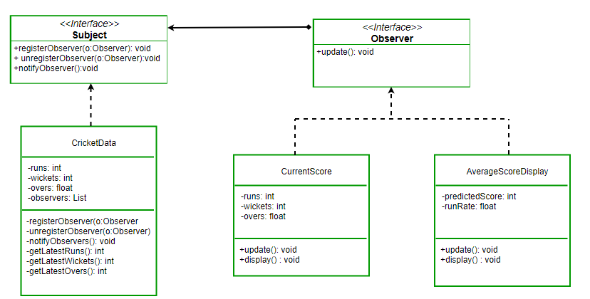

# Observer 디자인 패턴

# 01. 가장 실질적인 코드와 이를 활용하는 실제 사례

## 1. 구현 코드
[code](code)

## 2. 사용 사례
### 공통점 : 등록된 것들 모두에게 이벤트 

- GUI 이벤트 리스너
  -  이벤트 발생 시 리스너가 이를 감지하고 동작
  -  UI 이벤트와 리스너 간의 느슨한 결합을 유지
- 소셜 미디어 알림 시스템
  - 사용자가 팔로우한 계정의 상태 업데이트를 실시간으로 알림
  - 사용자의 업데이트를 Observer 패턴으로 구독 및 알림 처리

# 02.  패턴이 가지는 강점과 약점

## 1. 장단점
### 장점
#### 1. 느슨한 결합
    - Subject는 Observer의 세부 구현을 알 필요가 없음
#### 2. 동적 구독 관리
    - Observer를 실행 중에 동적으로 추가하거나 제거할 수 있어, 유연성이 높음
      - 소셜 미디어 앱에서 사용자가 알림을 구독하거나 취소
#### 3. 확장성
    - 새로운 Observer를 추가하더라도, Subject를 변경할 필요가 없으므로 확장성이 뛰어남
#### 4. 실시간 업데이트 가능
    - Subject의 상태 변화가 Observer에게 즉시 반영되므로, 실시간 알림에 적합

### 단점
#### 1. Observer 관리의 복잡성
    - 많은 Observer에 알림을 전송할 때 성능 저하 발생 가능
#### 2. 알림 순서 관리 어려움
    - 특정 Observer가 먼저 알림을 받아야 하는 경우, 추가적인 로직 필요
#### 3. 의도치 않은 의존성
    - Observer가 Subject의 상태 변화에 의존하게 되므로, 예기치 않은 사이드 이펙트가 발생할 수 있음

# 03. 동작 방식 이해 후, 이를 뒷받침하는 구조와 정의

## 1. 동작 원리
- 하나의 객체(Subject)가 상태를 변경하면, 관련된 모든 객체(Observers)가 자동으로 알림을 받음 

## 2. 구조 - 4
- 
- 출처 : https://www.geeksforgeeks.org/observer-pattern-set-2-implementation/

### 1) Subject (주체)
- 관찰자 목록을 유지하고 관리하며, 상태 변경 시 관찰자들에게 알림

### 2) ConcreteSubject (구체 주체)
- 상태를 저장하며, 상태가 변경될 때 관찰자들에게 알림
- 관찰자들에게 알리기 위해 notify() 메서드를 호출

### 3) Observer (관찰자)
- 주체의 상태 변경에 따라 알림을 받는 인터페이스로, update() 메서드를 정의

### 4) ConcreteObserver (구체 관찰자)
- Observer를 구현하며, update() 메서드를 통해 주체의 상태 변경 정보를 받음

## 3. 정의
-  객체 간 1:N 관계에서, 한 객체의 상태 변경이 다른 객체들에게 자동으로 통지되도록 설계된 패턴

## 4. 목적
### 1) 자동 상태 동기화
- Subject 상태 변경 시, 모든 Observer가 자동으로 상태를 반영

# 04.  패턴이 적합한 상황과 선택의 이유를 다른 패턴과 비교하며 학습

## 1. 적용 조건
- 이 패턴이 적합한 상황은 언제인가요?
- 적용하기 위한 전제 조건이나 특정 문제 유형을 설명하세요.

## 2. 비교와 선택
- 이 패턴을 다른 유사한 패턴과 비교하세요.
  - 예: Factory Method와 Abstract Factory의 차이.
- 어떤 상황에서 이 패턴을 선택해야 하는지 설명하세요.

## 3. 관련된 패턴
- 이 패턴과 함께 자주 사용되는 패턴은 무엇인가요?
  - 예: Decorator 패턴은 Strategy 패턴과 함께 사용되기도 함.
- 다른 패턴과의 관계를 설명하세요.
  - 예: 이 패턴이 다른 패턴의 일부로 사용되거나, 서로 보완적 역할을 하는 경우.

# 04.  패턴을 실제로 사용할 때 발생할 수 있는 문제와 실전 사례

## 1. 오해와 주의점
- 이 패턴과 관련된 일반적인 오해는 무엇인가요?
  - 예: Singleton은 무조건 하나의 인스턴스만 생성된다는 오해.
- 패턴을 잘못 사용할 때 발생할 수 있는 문제를 설명하세요.
  - 예: 잘못된 Singleton 구현은 멀티스레드 환경에서 동기화 문제를 유발.

## 2. 프로젝트 경험
- 이 패턴을 실제 프로젝트에서 사용한 경험이 있나요?
- 사용했던 사례와 그 결과를 기록하세요.
  - 프로젝트 이름, 패턴 적용 이유, 결과 등.

## 3. 확장성
- 이 패턴을 확장하거나 변형하는 방법은 무엇인가요?
  - 예: Prototype 패턴에서 깊은 복사와 얕은 복사를 선택적으로 구현.
- 확장 가능한 구조로 설계하기 위한 팁이나 예시를 작성하세요.

## 4. 비용
- 이 패턴을 사용하는 데 드는 비용(성능, 코드 복잡도 등)을 분석하세요.
  - 예: Decorator는 클래스 수가 증가하여 코드가 복잡해질 수 있음.
- 효율적으로 사용할 수 있는 방법을 설명하세요.
  - 예: 필요 이상의 Decorator를 사용하지 않고 핵심 기능에만 적용.