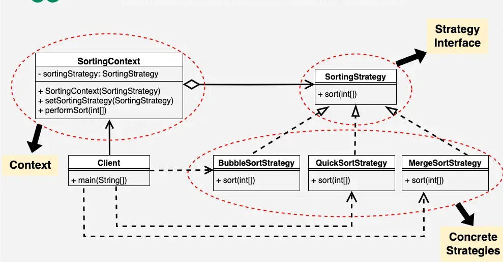

# Strategy 디자인 패턴

# 01. 가장 실질적인 코드와 이를 활용하는 실제 사례

## 1. 구현 코드
[code](code)

- Context는 전략 실행에만 집중
- 알고리즘 세부 사항은 Strategy가 담당 
- 어떤 전략을 사용할지 클라이언트가 선택

## 2. 사용 사례
### 공통점 : 목적에 따른 처리방법 변경 필요 시 

- 경로 탐색 시스템 (GPS)
  - 특정 조건(시간, 거리, 비용 등)에 따라 경로 탐색 알고리즘을 교체.
- 데이터 정렬 시스템
  - 데이터 크기, 정렬 우선순위, 성능 요구사항에 따라 다른 알고리즘을 사용.

# 02.  패턴이 가지는 강점과 약점

## 1. 장단점
### 장점
#### 1. 행동의 유연성
    - 동일한 작업을 다양한 방식으로 처리할 수 있도록, 런타임에 알고리즘을 교체 가능하게
#### 2. 코드 재사용성 증가
    - 각 알고리즘(Strategy)을 별도의 클래스로 분리하여, 코드 중복을 줄이고 재사용성을 높임
#### 3. 단일 책임 원칙(SRP) 준수
    - 작업을 수행하는 알고리즘과 클라이언트의 책임을 분리하여, 유지보수성을 향상

### 단점
#### 1. 클래스 수 증가
    - 각 알고리즘마다 별도의 클래스를 생성해야 하므로, 클래스 수가 많아질 수 있음
#### 2. 클라이언트에서 전략 선택 필요
    - Strategy를 클라이언트에서 설정해야 하므로, 클라이언트가 알고리즘 선택 로직을 알아야 할 수도 있음
#### 3. 단순 작업에 오버헤드 발생
    - 간단한 작업에도 Strategy 패턴을 적용하면, 불필요한 설계 복잡성과 호출 비용이 증가할 수 있음
#### 4. 코드의 흐름 추적 어려움
    - 런타임에 알고리즘이 동적으로 변경되므로, 코드의 실행 흐름을 추적하기 어려울 수 있음

# 03. 동작 방식 이해 후, 이를 뒷받침하는 구조와 정의

## 1. 동작 원리
- 알고리즘군을 정의하고, 각각을 캡슐화하여 서로 교환 가능하게 함 

## 2. 구조 - 3

- 출처 : https://www.geeksforgeeks.org/strategy-pattern-set-1/

### 1) Strategy (전략 인터페이스)
- 알고리즘의 공통 인터페이스를 정의

### 2) ConcreteStrategy (구체적 전략)
- Strategy 인터페이스를 구현하며, 특정 알고리즘을 정의
- 필요에 따라 여러 전략을 생성할 수 있음

### 3) Context (문맥)
- Strategy 객체를 포함하며, 실행 시점에 전략을 설정(setStrategy())하고 사용(executeStrategy())함
- 특정 전략의 세부 구현을 알 필요가 없음

### 4) Client
- 알맞은 전략을 이용하여 context와 같이 사용 

## 3. 정의
-  알고리즘군을 정의하고, 이를 캡슐화하여 동적으로 알고리즘을 교체 가능하게 하는 디자인 패턴

## 4. 목적 
### 1) 알고리즘 교체 가능

# 04.  패턴이 적합한 상황과 선택의 이유를 다른 패턴과 비교하며 학습

## 1. 적용 조건
- 이 패턴이 적합한 상황은 언제인가요?
- 적용하기 위한 전제 조건이나 특정 문제 유형을 설명하세요.

## 2. 비교와 선택
- 이 패턴을 다른 유사한 패턴과 비교하세요.
  - 예: Factory Method와 Abstract Factory의 차이.
- 어떤 상황에서 이 패턴을 선택해야 하는지 설명하세요.

## 3. 관련된 패턴
- 이 패턴과 함께 자주 사용되는 패턴은 무엇인가요?
  - 예: Decorator 패턴은 Strategy 패턴과 함께 사용되기도 함.
- 다른 패턴과의 관계를 설명하세요.
  - 예: 이 패턴이 다른 패턴의 일부로 사용되거나, 서로 보완적 역할을 하는 경우.

# 04.  패턴을 실제로 사용할 때 발생할 수 있는 문제와 실전 사례

## 1. 오해와 주의점
- 이 패턴과 관련된 일반적인 오해는 무엇인가요?
  - 예: Singleton은 무조건 하나의 인스턴스만 생성된다는 오해.
- 패턴을 잘못 사용할 때 발생할 수 있는 문제를 설명하세요.
  - 예: 잘못된 Singleton 구현은 멀티스레드 환경에서 동기화 문제를 유발.

## 2. 프로젝트 경험
- 이 패턴을 실제 프로젝트에서 사용한 경험이 있나요?
- 사용했던 사례와 그 결과를 기록하세요.
  - 프로젝트 이름, 패턴 적용 이유, 결과 등.

## 3. 확장성
- 이 패턴을 확장하거나 변형하는 방법은 무엇인가요?
  - 예: Prototype 패턴에서 깊은 복사와 얕은 복사를 선택적으로 구현.
- 확장 가능한 구조로 설계하기 위한 팁이나 예시를 작성하세요.

## 4. 비용
- 이 패턴을 사용하는 데 드는 비용(성능, 코드 복잡도 등)을 분석하세요.
  - 예: Decorator는 클래스 수가 증가하여 코드가 복잡해질 수 있음.
- 효율적으로 사용할 수 있는 방법을 설명하세요.
  - 예: 필요 이상의 Decorator를 사용하지 않고 핵심 기능에만 적용.