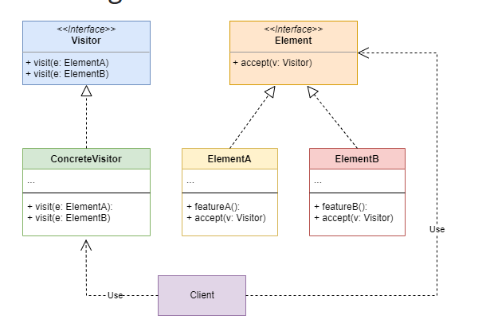

# Visitor 디자인 패턴

# 01. 가장 실질적인 코드와 이를 활용하는 실제 사례

## 1. 구현 코드
[code] (code)

- Visitor (방문자 인터페이스)
  - 객체 구조의 각 요소(Element)를 방문하는 메서드를 정의.
- ObjectStructure (객체 구조)
  - Element 객체를 관리하며, Visitor를 전달.
- Element (요소 인터페이스)
  - Visitor를 받아들이는 메서드(accept())를 정의.
- ConcreteElement (구체적 요소)
  - Element 인터페이스를 구현하며, Visitor를 호출.

- 객체 구조(Element)와 작업(Visitor)을 분리 -> 유지보수성 
- Visitor를 추가하는 것으로 새로운 작업 구현.

## 2. 사용 사례
### 공통점 : 고정된 객체에 다양한 작업 추가 시 

- 게임 객체 관리
  - 객체의 구조는 고정되어 있지만, 작업(상태 변경, 효과 추가)은 다양하고 유연하게 추가
    - Visitor: 상태 변경, 효과 적용, 스코어 계산.
    - Element: 캐릭터, 무기, 아이템

- 커머스 시스템
  - 제품과 주문의 구조는 고정되지만, 작업은 자주 추가되거나 변경 가능
    - Visitor: 할인 계산, 세금 계산, 배송비 계산
      - Element: 제품, 주문

# 02.  패턴이 가지는 강점과 약점

## 1. 장단점
### 장점 3
#### 1. 알고리즘 분리로 책임 분산
    - 데이터 구조(Element)와 작업(Visitor)을 분리하여, 서로 다른 작업을 유연하게 추가할 수 있음
#### 2. 새로운 동작(Visitor) 추가 용이
    - 데이터 구조를 변경하지 않고, 새로운 작업을 추가할 수 있어 확장성이 좋음
      - 제품 데이터 구조에 할인 계산, 세금 계산, 배송비 계산 Visitor 추가.
#### 3. 작업의 일관성 유지
    - Visitor 객체에서 작업을 구현하므로, 모든 Element에 대해 일관된 작업 방식을 보장
      - 다양한 제품군에 동일한 할인 정책을 적용

### 단점 3
#### 1. Element의 변경 어려움
    - Visitor는 데이터 구조(Element)의 내부 상태를 탐색하므로, Element 클래스가 변경되면 모든 Visitor를 수정해야 함
#### 2. 복잡성 증가
    - 각 작업마다 새로운 Visitor 클래스를 작성해야 하므로, 클래스와 코드 수가 증가
#### 3. Element-Visitor 결합도 증가
    - Element는 Visitor를 받아들이는 메서드(accept)를 반드시 구현해야 하므로, Element와 Visitor 간의 결합도가 높아질 수 있음

# 03. 동작 방식 이해 후, 이를 뒷받침하는 구조와 정의

## 1. 동작 원리
- Visitor 객체를 사용하여 객체 구조를 탐색하고, 각 요소에 대해 작업을 수행

## 2. 구조

### 1) Visitor (방문자 인터페이스)
- 객체 구조를 탐색하며, 각 요소에 대해 실행할 작업을 정의합니다.
- 예: visit(ElementA), visit(ElementB).

### 2) ConcreteVisitor (구체 방문자)
- Visitor 인터페이스를 구현하며, 요소별 작업을 정의합니다.
- 예: 각 요소의 데이터를 출력하거나, 특정 작업을 수행.

### 3) Element (요소 인터페이스)
- 객체 구조의 요소를 정의하며, accept(Visitor) 메서드를 통해 Visitor를 받아들입니다.

### 4) ConcreteElement (구체 요소)
- Element를 구현하며, Visitor가 작업을 수행할 수 있도록 자신의 상태를 전달합니다.

## 3. 정의
- 객체 구조와 별도로, 새로운 작업(동작)을 추가할 수 있는 디자인 패턴

## 4. 목적
### 1) [객체 구조]와 [작업]의 분리

# 04.  패턴이 적합한 상황과 선택의 이유를 다른 패턴과 비교하며 학습

## 1. 적용 조건
- 이 패턴이 적합한 상황은 언제인가요?
- 적용하기 위한 전제 조건이나 특정 문제 유형을 설명하세요.

## 2. 비교와 선택
- 이 패턴을 다른 유사한 패턴과 비교하세요.
  - 예: Factory Method와 Abstract Factory의 차이.
- 어떤 상황에서 이 패턴을 선택해야 하는지 설명하세요.

## 3. 관련된 패턴
- 이 패턴과 함께 자주 사용되는 패턴은 무엇인가요?
  - 예: Decorator 패턴은 Strategy 패턴과 함께 사용되기도 함.
- 다른 패턴과의 관계를 설명하세요.
  - 예: 이 패턴이 다른 패턴의 일부로 사용되거나, 서로 보완적 역할을 하는 경우.

# 04.  패턴을 실제로 사용할 때 발생할 수 있는 문제와 실전 사례

## 1. 오해와 주의점
- 이 패턴과 관련된 일반적인 오해는 무엇인가요?
  - 예: Singleton은 무조건 하나의 인스턴스만 생성된다는 오해.
- 패턴을 잘못 사용할 때 발생할 수 있는 문제를 설명하세요.
  - 예: 잘못된 Singleton 구현은 멀티스레드 환경에서 동기화 문제를 유발.

## 2. 프로젝트 경험
- 이 패턴을 실제 프로젝트에서 사용한 경험이 있나요?
- 사용했던 사례와 그 결과를 기록하세요.
  - 프로젝트 이름, 패턴 적용 이유, 결과 등.

## 3. 확장성
- 이 패턴을 확장하거나 변형하는 방법은 무엇인가요?
  - 예: Prototype 패턴에서 깊은 복사와 얕은 복사를 선택적으로 구현.
- 확장 가능한 구조로 설계하기 위한 팁이나 예시를 작성하세요.

## 4. 비용
- 이 패턴을 사용하는 데 드는 비용(성능, 코드 복잡도 등)을 분석하세요.
  - 예: Decorator는 클래스 수가 증가하여 코드가 복잡해질 수 있음.
- 효율적으로 사용할 수 있는 방법을 설명하세요.
  - 예: 필요 이상의 Decorator를 사용하지 않고 핵심 기능에만 적용.