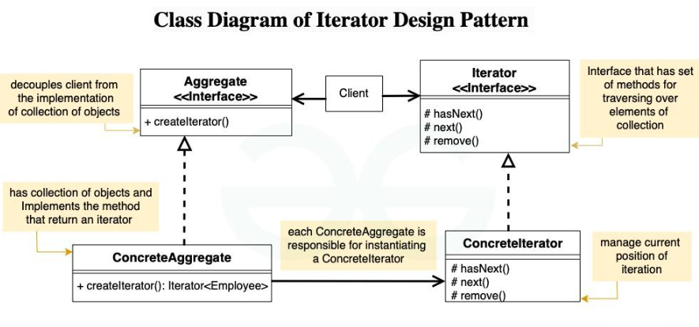

# Iterator 디자인 패턴

# 01. 가장 실질적인 코드와 이를 활용하는 실제 사례

## 1. 구현 코드
[code](code)

## 2. 사용 사례
### 공통점 : 내부 구현 감추고, 일관된 탐색 방법

- 자바 컬렉션 프레임워크
  - 각 컬렉션의 내부 구현(배열, 해시맵 등)과 관계없이 동일 방식으로 요소 탐색
- 사용자 정의 컬렉션
  - 커스텀 데이터 구조의 내부 구현을 감추고 외부에서 요소를 순회할 수 있도록 

# 02.  패턴이 가지는 강점과 약점

## 1. 장단점
### 장점 3
#### 1. 내부 구조의 캡슐화
    - 컬렉션의 내부 구조를 클라이언트로부터 숨기고, 일관된 방식으로 접근을 제공
#### 2. 일관된 접근 방식 제공
    - 다양한 컬렉션 구조(배열, 트리, 해시맵 등)에 대해 통일된 접근 인터페이스를 제공
#### 3. SRP(단일 책임 원칙) 준수
    - 컬렉션 클래스는 데이터 저장에 집중하고, 순회 로직은 Iterator가 담당하여 책임을 분리

### 단점 3
#### 1. 단방향 순회 제한
    - 기본적으로 Iterator는 단방향 순회만 가능하며, 이전 요소로 이동하려면 추가적인 구현이 필요
#### 2. 병렬 수정 문제
    - 컬렉션이 순회 중 수정되면, ConcurrentModificationException이 발생할 가능성
#### 3. 특정 요소 접근 어려움
    - Iterator는 순차 접근 방식만 제공하므로, 특정 요소에 즉시 접근하기 어려움

# 03. 동작 방식 이해 후, 이를 뒷받침하는 구조와 정의

## 1. 동작 원리
-  컬렉션(리스트, 배열, 맵 등) 내부 구조를 노출하지 않고, 일관된 방식으로 요소를 순회하는 방법을 제공

## 2. 구조 - 4

- 출처 : https://www.geeksforgeeks.org/iterator-pattern/

### 1) Iterator (인터페이스)
- 컬렉션 요소를 탐색하는 공통 인터페이스를 정의
  - 예: hasNext(), next(), remove().

### 2) ConcreteIterator (구체적 반복자)
- Iterator 인터페이스를 구현하며, 특정 컬렉션의 요소를 탐색
- 내부적으로 현재 위치(인덱스)를 유지하여 순회를 관리

### 3) Aggregate (집합체 인터페이스)
- 컬렉션의 반복자를 생성하는 메서드(createIterator())를 정의

### 4) ConcreteAggregate (구체적 집합체)
- Aggregate를 구현하며, 컬렉션 요소를 저장하고 반복자를 생성

## 3. 정의
- 컬렉션의 내부 구조를 노출하지 않고, 일관된 방식으로 요소를 순회할 수 있는 디자인 패턴

## 4. 목적 
### 1) 컬렉션의 내부 노출 없이 요소 탐색 가능하게 

# 04.  패턴이 적합한 상황과 선택의 이유를 다른 패턴과 비교하며 학습

## 1. 적용 조건
- 이 패턴이 적합한 상황은 언제인가요?
- 적용하기 위한 전제 조건이나 특정 문제 유형을 설명하세요.

## 2. 비교와 선택
- 이 패턴을 다른 유사한 패턴과 비교하세요.
  - 예: Factory Method와 Abstract Factory의 차이.
- 어떤 상황에서 이 패턴을 선택해야 하는지 설명하세요.

## 3. 관련된 패턴
- 이 패턴과 함께 자주 사용되는 패턴은 무엇인가요?
  - 예: Decorator 패턴은 Strategy 패턴과 함께 사용되기도 함.
- 다른 패턴과의 관계를 설명하세요.
  - 예: 이 패턴이 다른 패턴의 일부로 사용되거나, 서로 보완적 역할을 하는 경우.

# 04.  패턴을 실제로 사용할 때 발생할 수 있는 문제와 실전 사례

## 1. 오해와 주의점
- 이 패턴과 관련된 일반적인 오해는 무엇인가요?
  - 예: Singleton은 무조건 하나의 인스턴스만 생성된다는 오해.
- 패턴을 잘못 사용할 때 발생할 수 있는 문제를 설명하세요.
  - 예: 잘못된 Singleton 구현은 멀티스레드 환경에서 동기화 문제를 유발.

## 2. 프로젝트 경험
- 이 패턴을 실제 프로젝트에서 사용한 경험이 있나요?
- 사용했던 사례와 그 결과를 기록하세요.
  - 프로젝트 이름, 패턴 적용 이유, 결과 등.

## 3. 확장성
- 이 패턴을 확장하거나 변형하는 방법은 무엇인가요?
  - 예: Prototype 패턴에서 깊은 복사와 얕은 복사를 선택적으로 구현.
- 확장 가능한 구조로 설계하기 위한 팁이나 예시를 작성하세요.

## 4. 비용
- 이 패턴을 사용하는 데 드는 비용(성능, 코드 복잡도 등)을 분석하세요.
  - 예: Decorator는 클래스 수가 증가하여 코드가 복잡해질 수 있음.
- 효율적으로 사용할 수 있는 방법을 설명하세요.
  - 예: 필요 이상의 Decorator를 사용하지 않고 핵심 기능에만 적용.