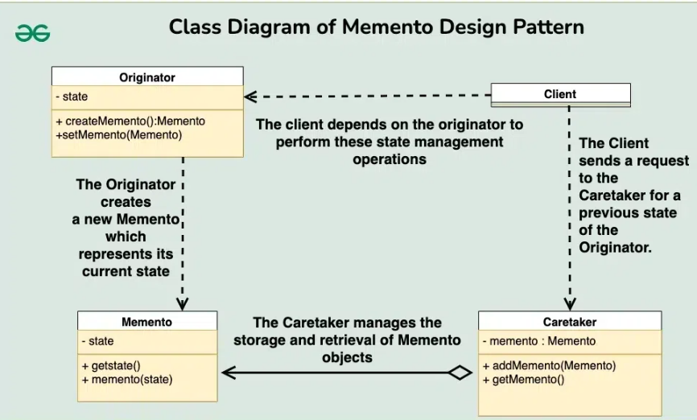

# Memento 디자인 패턴

# 01. 가장 실질적인 코드와 이를 활용하는 실제 사례

## 1. 구현 코드
[code](code)[code] (code)

## 2. 사용 사례
### 공통점 : 이전 상태 기록 및 복원 시 

- 텍스트 편집기
  - 이전 상태로 돌아가는 실행 취소(Undo) 기능
- 게임 저장 시스템
  - 중단 후 재개할 때, 이전 상태로 복원.

# 02.  패턴이 가지는 강점과 약점

## 1. 장단점
### 장점 4
#### 1. 상태 복원 기능 제공
    -  객체의 이전 상태를 저장하여, Undo/Redo 또는 상태 복원이 가능하도록 함
#### 2. 캡슐화 유지
    - 객체의 내부 상태를 외부에 노출하지 않고 저장 가능하며, 캡슐화 원칙을 준수
#### 3. 복잡한 상태 관리 단순화
    - Originator의 상태 복원 로직을 캡슐화하여, 상태 복원 과정을 단순화
      - CareTaker가 Memento를 관리하면, Originator는 상태 저장과 복원을 간단히 처리
#### 4. 내역 관리 가능
    - 객체의 상태를 기록하여, 다양한 시점으로 되돌릴 수 있는 기능을 제공

### 단점 2
#### 1. 상태 관리의 복잡성
    - Memento 객체가 많아질수록, CareTaker에서 상태 관리와 삭제 로직이 복잡해질 수 있음 
#### 2. CareTaker 의존성 증가
    - CareTaker가 Memento의 생명 주기를 관리해야 하므로, 추가적인 관리 책임이 발생

# 03. 동작 방식 이해 후, 이를 뒷받침하는 구조와 정의

## 1. 동작 원리
- Memento 객체를 통해 Originator의 상태를 저장하고, 필요 시 이전 상태로 복원

## 2. 구조

- 출처 : https://www.geeksforgeeks.org/memento-design-pattern/

### 1) Memento (메멘토)
- 객체의 상태를 저장
- Originator의 내부 상태를 캡슐화하여 외부에 노출하지 않음

### 2) Originator (원본 객체)
- 자신의 상태를 저장하고, Memento를 사용하여 상태를 복원
  - saveState() 메서드를 통해 현재 상태를 Memento로 저장.
  - restoreState() 메서드를 통해 저장된 Memento에서 상태를 복원

### 3) Caretaker (관리자)
- Memento 객체를 관리하며, 저장된 상태를 보관하고 필요할 때 제공
- Originator와 Memento 간의 연결을 유지

## 3. 정의
-  객체의 이전 상태를 저장하고, 복원 기능을 제공하는 디자인 패턴

## 4. 목적
- 상태 기록 및 복원

# 04.  패턴이 적합한 상황과 선택의 이유를 다른 패턴과 비교하며 학습

## 1. 적용 조건
- 이 패턴이 적합한 상황은 언제인가요?
- 적용하기 위한 전제 조건이나 특정 문제 유형을 설명하세요.

## 2. 비교와 선택
- 이 패턴을 다른 유사한 패턴과 비교하세요.
  - 예: Factory Method와 Abstract Factory의 차이.
- 어떤 상황에서 이 패턴을 선택해야 하는지 설명하세요.

## 3. 관련된 패턴
- 이 패턴과 함께 자주 사용되는 패턴은 무엇인가요?
  - 예: Decorator 패턴은 Strategy 패턴과 함께 사용되기도 함.
- 다른 패턴과의 관계를 설명하세요.
  - 예: 이 패턴이 다른 패턴의 일부로 사용되거나, 서로 보완적 역할을 하는 경우.

# 04.  패턴을 실제로 사용할 때 발생할 수 있는 문제와 실전 사례

## 1. 오해와 주의점
- 이 패턴과 관련된 일반적인 오해는 무엇인가요?
  - 예: Singleton은 무조건 하나의 인스턴스만 생성된다는 오해.
- 패턴을 잘못 사용할 때 발생할 수 있는 문제를 설명하세요.
  - 예: 잘못된 Singleton 구현은 멀티스레드 환경에서 동기화 문제를 유발.

## 2. 프로젝트 경험
- 이 패턴을 실제 프로젝트에서 사용한 경험이 있나요?
- 사용했던 사례와 그 결과를 기록하세요.
  - 프로젝트 이름, 패턴 적용 이유, 결과 등.

## 3. 확장성
- 이 패턴을 확장하거나 변형하는 방법은 무엇인가요?
  - 예: Prototype 패턴에서 깊은 복사와 얕은 복사를 선택적으로 구현.
- 확장 가능한 구조로 설계하기 위한 팁이나 예시를 작성하세요.

## 4. 비용
- 이 패턴을 사용하는 데 드는 비용(성능, 코드 복잡도 등)을 분석하세요.
  - 예: Decorator는 클래스 수가 증가하여 코드가 복잡해질 수 있음.
- 효율적으로 사용할 수 있는 방법을 설명하세요.
  - 예: 필요 이상의 Decorator를 사용하지 않고 핵심 기능에만 적용.