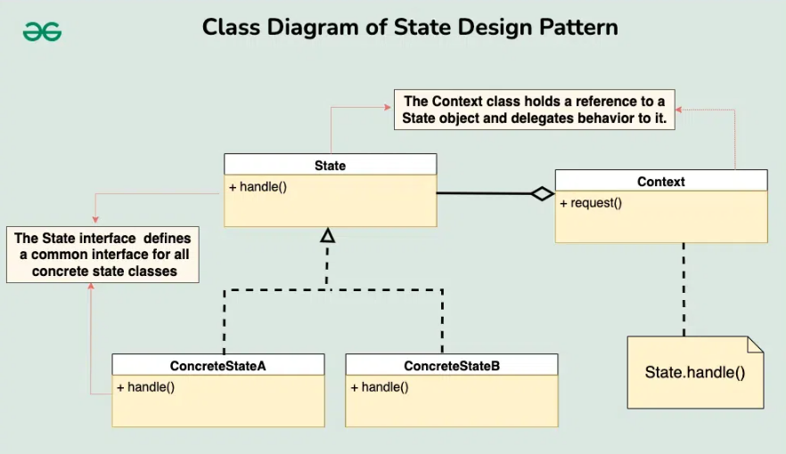

# State 디자인 패턴

# 01. 가장 실질적인 코드와 이를 활용하는 실제 사례

## 1. 구현 코드
[code](code)

## 2. 사용 사례
### 공통점 : 상태에 따른 동작 다르게 

- 비디오 플레이어
  -  "재생", "일시정지", "정지" 상태에서 다른 동작 수행.
- 게임 캐릭터 상태
  - 상태 전환(걷기 → 뛰기 → 점프하기)을 캡슐화.

# 02.  패턴이 가지는 강점과 약점

## 1. 장단점
### 장점
#### 1. 상태 전환 로직 캡슐화
    -  상태 전환 로직을 상태 객체에 캡슐화하여, 코드 가독성을 향상시키고 클라이언트 코드를 단순화
#### 2. SRP(단일 책임 원칙) 준수
    - 각 상태는 고유한 행동을 가지며, 상태별로 로직을 분리하여 코드 유지보수성을 높임.
#### 3. 상태 기반 동작 구현 용이
    - 클라이언트 코드가 상태를 직접 확인하지 않고, 상태 객체를 통해 동작을 실행할 수 있음.

### 단점 
#### 1. 클래스 수 증가
    - 각 상태를 별도의 클래스로 구현해야 하므로, 상태의 수가 많아질수록 클래스 수가 증가.
#### 2. 상태 간 결합
    - 특정 상태가 다른 상태를 직접 참조해야 하는 경우, 상태 간 의존성이 증가할 수 있음
      - 상태 전환 로직이 여러 상태 객체에 분산되면, 상태를 추가하거나 수정할 때 각 상태 객체의 의존성을 고려해야 함
      - ex) 재생 중(Playing) → 일시정지(Paused) → 정지(Stopped)
#### 3. 상태 전환의 가시성 부족
    - 상태 전환 로직이 각 상태 객체에 분리되어 있기 때문에, 클라이언트는 상태 전환 과정을 직접 알기 어려움
      - 연결 중(Connecting) → 연결됨(Connected) → 연결 끊김(Disconnected)
      - 상태 전환 도중 문제가 발생해 "연결 중" 상태에서 "연결 끊김" 상태로 바로 전환
      - 클라이언트는 상태 전환 흐름을 직접 추적할 방법이 없으므로, 어디서 문제가 발생했는지 파악하기 어려울 수 있음

# 03. 동작 방식 이해 후, 이를 뒷받침하는 구조와 정의

## 1. 동작 원리
- 상태를 객체로 분리하고, Context는 현재 상태를 참조하여 작업을 수행

## 2. 구조

- 출처 : https://www.geeksforgeeks.org/state-design-pattern/

### 1) State (상태 인터페이스)
- 각 상태에서 수행할 행동을 정의
  - 예: handle(Context) 메서드.

### 2) ConcreteState (구체 상태)
- State 인터페이스를 구현하며, 각 상태에서의 동작을 정의
- 상태 전환을 Context에게 요청할 수도 있음

### 3) Context (문맥)
- 현재 상태를 관리하며, 상태 전환을 요청
- 클라이언트는 Context를 통해 작업을 수행하며, 현재 상태에 따라 동작이 달라짐

## 3. 정의
- 객체의 상태를 캡슐화하여, 상태에 따른 행동 변화를 구현하는 디자인 패턴

## 4. 목적
### 1) 상태 기반 행동 변경

# 04.  패턴이 적합한 상황과 선택의 이유를 다른 패턴과 비교하며 학습

## 1. 적용 조건
- 이 패턴이 적합한 상황은 언제인가요?
- 적용하기 위한 전제 조건이나 특정 문제 유형을 설명하세요.

## 2. 비교와 선택
- 이 패턴을 다른 유사한 패턴과 비교하세요.
  - 예: Factory Method와 Abstract Factory의 차이.
- 어떤 상황에서 이 패턴을 선택해야 하는지 설명하세요.

## 3. 관련된 패턴
- 이 패턴과 함께 자주 사용되는 패턴은 무엇인가요?
  - 예: Decorator 패턴은 Strategy 패턴과 함께 사용되기도 함.
- 다른 패턴과의 관계를 설명하세요.
  - 예: 이 패턴이 다른 패턴의 일부로 사용되거나, 서로 보완적 역할을 하는 경우.

# 04.  패턴을 실제로 사용할 때 발생할 수 있는 문제와 실전 사례

## 1. 오해와 주의점
- 이 패턴과 관련된 일반적인 오해는 무엇인가요?
  - 예: Singleton은 무조건 하나의 인스턴스만 생성된다는 오해.
- 패턴을 잘못 사용할 때 발생할 수 있는 문제를 설명하세요.
  - 예: 잘못된 Singleton 구현은 멀티스레드 환경에서 동기화 문제를 유발.

## 2. 프로젝트 경험
- 이 패턴을 실제 프로젝트에서 사용한 경험이 있나요?
- 사용했던 사례와 그 결과를 기록하세요.
  - 프로젝트 이름, 패턴 적용 이유, 결과 등.

## 3. 확장성
- 이 패턴을 확장하거나 변형하는 방법은 무엇인가요?
  - 예: Prototype 패턴에서 깊은 복사와 얕은 복사를 선택적으로 구현.
- 확장 가능한 구조로 설계하기 위한 팁이나 예시를 작성하세요.

## 4. 비용
- 이 패턴을 사용하는 데 드는 비용(성능, 코드 복잡도 등)을 분석하세요.
  - 예: Decorator는 클래스 수가 증가하여 코드가 복잡해질 수 있음.
- 효율적으로 사용할 수 있는 방법을 설명하세요.
  - 예: 필요 이상의 Decorator를 사용하지 않고 핵심 기능에만 적용.